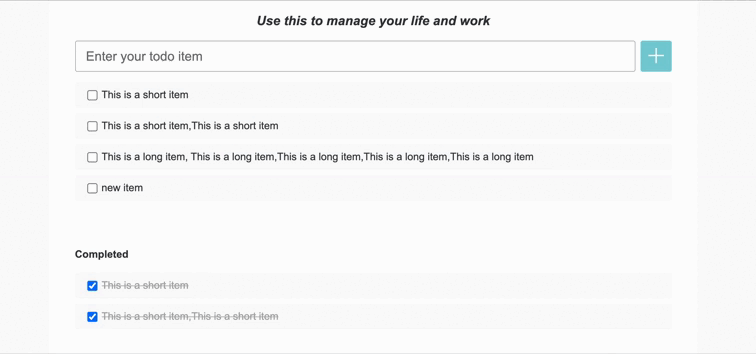

# Todo List JS Assignment

## 需求说明

### Story 1 显示 Task 列表

作为一个用户，我应当能看到已经添加过的 Task，包括 Todo 列表和 Completed 列表。  
若 Task Items 较多，则会出现纵向滚动条。 效果如下：


### Story 2 添加 Task

作为一个用户，我应当能够添加 Task。这样我就可以创建待办事项列表了。

#### AC 1 添加 Task

* 当用户在输入框输入内容之后，点击 “+” 按钮可以在 Todo 列表中第一个位置添加一个新的 item。
* 当新的 task 添加完成之后，应当清空输入框中的文字。

#### AC 2 避免开头和结尾的空格

* 当用户输入的文本的开头和结尾含有空白字符的时候，在添加过程中应当去掉这些空白字符。例如我输入 “  Good  ”，则最终添加的内容应当是 “Good”。空白字符以 `String.prototype.trim` 的默认情况为准。

#### AC 3 错误检查

* 当用户在输入框没有输入内容，或输入的内容全部为空白字符的时候，在输入框下方显示一个错误消息：“Please input something first.”
* 当用户成功的添加了一个 Task 之后，错误信息消失。


### Story 3 删除待办事项

作为一个用户，我希望能够删除不需要的 Task

#### AC 1 删除未完成的 Task item

* 当鼠标放在 Todo task item 上时，显示"删除"按钮，点击"删除"按钮，该条 item 从列表消失。

#### AC 1 删除已完成的 Task item

* 当鼠标放在 Completed task item 上时，显示"删除"按钮，点击"删除"按钮，该条 item 从列表消失。


### Story 4 标记完成状态

作为一个用户，当我变更 Task 状态的时候，希望能够明显的观察到他们的位置变化，这样我更容易看清整体的任务情况。

#### AC 1 完成状态的显示与切换

* 当一个 Todo task item 被标记为完成状态（checkbox 被勾选）的时候，item 应该从 Todo List 移除，并且出现在 Completed List。
* 当一个 Todo task item 被重新激活（checkbox 取消勾选）的时候，item 应该从 Completed List 移除，并且出现在 Todo List。




## 架构图


## 前端环境准备

### 下载依赖

```bash
npm install
```

### 运行网站

请执行如下代码运行网站并打开页面：

```bash
npm start
```
之后在浏览器中访问：http://localhost:1234

### 启动 Json Server

```
npm run server
```
启动 json server 后可以，可以使用以下 API      
- 获取 tasks 数据:  
```
  URL: 'http://localhost:8080/tasks'
  Method: GET
  Response status: 200
  Response body 示例: [{id: 1, name: 'xx', completed: false}, {id: 2, name: 'xx', completed: false}]
```
- 创建 task:   
```
  URL: 'http://localhost:8080/tasks'
  Method: POST
  Request body 示例: {name: 'xx', completed: false}
  Response status: 201
  Response body 示例: {id: 1, name: 'xx', completed: false}
```
- 删除指定 id 的 task: 
```
  URL: 'http://localhost:8080/tasks/${id}'
  Method: DELETE,
  Response status: 204
  Response body 示例: {}
```
- 修改指定 id 的 task: 
```
  URL: 'http://localhost:8080/tasks/${id}'
  Method: PUT,
  Request body 示例: {name: 'xx', completed: false}
  Response status: 200
  Response body 示例: {id: 1, name: 'xx', completed: false}
```

#### 注意
- **json server 是用来 Mock 真实 API 的，当后端 API 没有准备好的时候可以使用 json-server Mock API 返回值，当后端 API 准备好之后关闭 json-server，直接请求后端提供的 API 即可**  
- **前端测试的时候也需要启动json-server Mock API 返回值**

### 运行测试

**具体操作可以查看运行测试Demo视频**

#### 前端测试
后端没有准备好的情况下，运行测试前需要先启动本地 Mock Api Server (json-server)
```
npm run server
npm start
npm run test 
```
#### 端到端测试
前后端都准备好的情况下，运行端到端测试
```
// 去到后端项目目录下启动后端服务
./start-mysql-from-docker.sh 
./gradlew run

// 在前端项目目录下启动前端服务，然后运行测试
npm start
npm run test:e2e
```
**注意：我们 buddy review 的时候是运行的是端到端的测试**

#### 运行单个测试
```
// 默认是前端的测试 （启用 json-server 的时候）
npx cypress run test --spec "cypress/integration/add_task.test.js" 
// 或者
node_modules/.bin/cypress run test --spec "cypress/integration/add_task.test.js"

// 如果想跑单个的端到端测试
npx cypress test --spec "cypress/integration/add_task.test.js" --env scene=e2e
// 或者
node_modules/.bin/cypress run test --spec "cypress/integration/add_task.test.js" --env scene=e2e
```

如果测试失败，可以在 `cypress/screenshots` 查看失败的截图

#### 关于测试细节
**请先阅读 `cypress/integration/*` 目录下的测试代码, 测试通过对 html 以及 class 命名有一定要求，不要修改 index.html 文件**

### Lint 检查

如需对代码执行 Lint 检查，请执行如下命令：

```bash
$ npm run lint
```
